# System Architecture

Our application is built on a modern, cloud-native architecture hosted entirely on AWS.

## Architecture Diagram

The diagram below illustrates the flow of a user's request from their browser through our infrastructure to the final processing and external service integrations.

```mermaid
graph TD
    subgraph "User"
        Client["👤 User (Browser/Postman)"]
    end

    subgraph "External Services"
        Stripe["💳 Stripe API"]
        Slack["💬 Slack API"]
    end

    subgraph "AWS Cloud Infrastructure"
        DNS["🌐 DNS (e.g., Namecheap)"]
        ACM["🔒 AWS Certificate Manager"]
        ALB["AWS Application Load Balancer <br/> Handles HTTPS/SSL"]
        EC2["EC2 Instance <br/> 🌱 Spring Boot App"]
        RDS["🐘 AWS RDS <br/> PostgreSQL Database"]
    end

    Client -- "1. HTTPS Request to shop.deniz.fyi" --> DNS
    DNS -- "2. Resolves domain to ALB IP" --> ALB
    ACM -- "3. Provides SSL Certificate" --> ALB
    ALB -- "4. Forwards decrypted HTTP Traffic" --> EC2
    EC2 -- "5. CRUD Operations" --> RDS
    EC2 -- "6a. Payment Processing" --> Stripe
    EC2 -- "6b. Sends Notifications" --> Slack
```

## Component Explanations

* DNS (Domain Name System): the internet's phonebook; translates our domain name (shop.deniz.fyi) to a server IP address.
* AWS (Amazon Web Services): a cloud provider; hosts the entire application infrastructure.
* ALB (Application Load Balancer): the main entry point for user traffic; distributes requests and handles HTTPS security.
* HTTPS (Hypertext Transfer Protocol Secure): ensures a secure, encrypted connection between the user's browser and our server.
* SSL (Secure Sockets Layer): the standard security technology used to create the encrypted HTTPS link.
* ACM (AWS Certificate Manager): the AWS service that provides and automatically renews our free SSL certificate.
* EC2 (Elastic Compute Cloud): the virtual server in the AWS cloud where our Spring Boot application runs.
* RDS (Relational Database Service): the managed AWS service that runs our PostgreSQL database, handling backups and maintenance.
* API (Application Programming Interface): a set of rules for communication between software; our app exposes an API and consumes APIs from Stripe and Slack.
