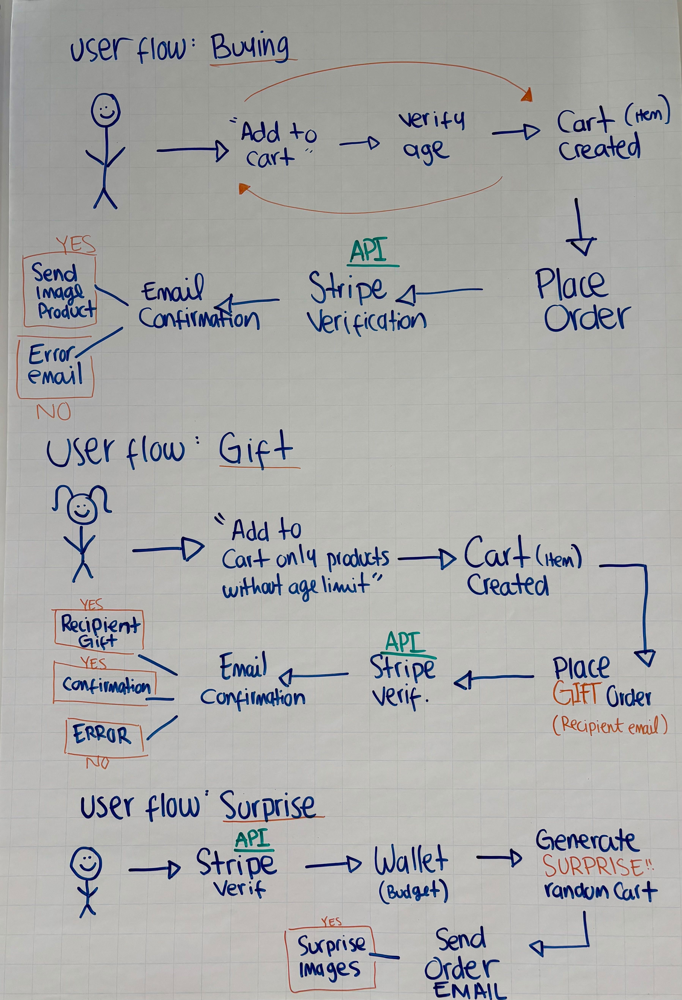

# Service Planning Document: Spaeti-SnackEnd

## 1. Product/Service Overview

**Service Name:** Spaeti-SnackEnd Gift-Sender
**Tagline:** Send snacks and drinks as gifts, with instant order notification delivered via Email and Slack.

**Core Product:** A digital gifting platform that enables users to purchase curated snack and beverage packages for
colleagues, friends, or clients. The recipient receives a private notification within their Email and Slack Spaeti
SnackEnd workspace, announcing the gift and delivering a personalized message.

**Key Value Proposition:**

- **For Senders:** A frictionless way to show appreciation, celebrate wins, or brighten someone's day without needing a
  physical address.
- **For Recipients:** A delightful, surprise moment of joy directly in their workflow (Email and Slack), with no redemption
  hassle.
- **For Companies:** Boosts morale and fosters a positive culture through easy peer-to-peer recognition.

---

## 2. Key Assumptions

### Target User Base (Personas)

1. **The Appreciative Colleague (Primary):**
    - **Role:** Knowledge worker in a tech-forward company.
    - **Use Case:** Wants to quickly thank a teammate for help on a project or celebrate a birthday.
    - **Assumption:** Is comfortable making small online purchases and is an active Email and Slack user.

2. **The Culture Manager (Secondary):**
    - **Role:** HR, team lead, or office manager.
    - **Use Case:** Looking for a scalable way to distribute rewards, welcome new hires, or celebrate work
      anniversaries.
    - **Assumption:**
        - Values ease of bulk purchasing and expensing.
        - Needs admin controls and reporting.

---
# 3. Data Privacy & Communication Compliance

- **Permission:** The act of sending a gift serves as consent for the sender's name to be shared with the recipient.
- **Marketing:** Recipient emails must **not** be added to a marketing list. They can only be contacted regarding the
  specific gift (e.g., a follow-up satisfaction survey).
- **Data Handling:** All personal data (emails, Slack IDs, messages) must be stored and processed in compliance with
  GDPR(General Data Protection Regulation). Users must have the right to be forgotten.
