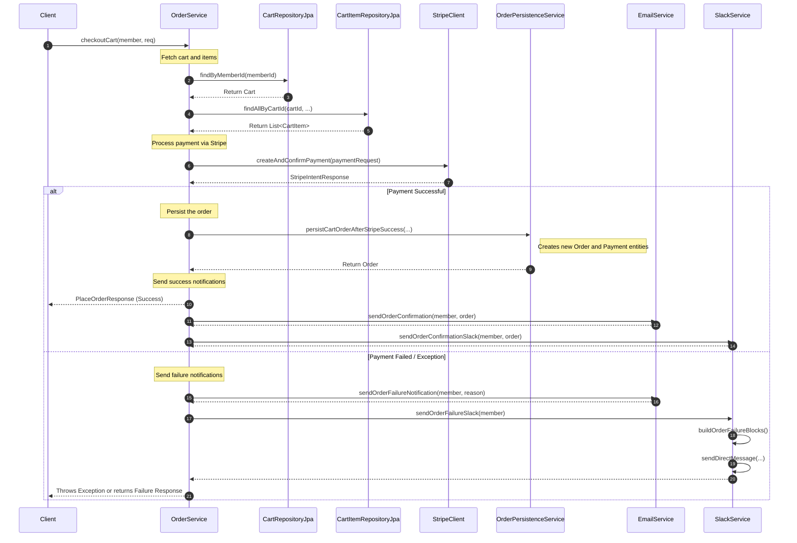

# Tech Stack and System Architecture

## What We Built
A gift delivery system that lets members send treats to each other, 
with automatic Email and Slack notifications.

## Key Features
- **Gift Purchasing**: Easy ordering flow for members
- **Instant Notifications**: Automatic Email and Slack messages when gifts are sent

## System Architecture (Simple View)

- **Layered-Architecture** 
System organized into horizontal layers, each with a specific responsibility:
  - Business Layer: Core logic and rules
  - Data Access Layer: Database interactions

- **Event-Drive-Architecture (EDA)**
System where components communicate through events (messages) rather than direct calls. When something happens, it emits an event, and other components react.
When or Why you might want it:
- When you need scalability - handling thousands of gift orders
- When processes are asynchronous - Slack notifications don't need to block order processing
- When adding new features - add a new service that listens to "gift sent" events
- When you need reliability - events can be retried if Slack is down

## Sequence Diagram (Order-Flow)

## How It Works - Gift Flow
1. **Member** buys gift on website
2. **System** processes payment, send confirmation or failure notification, order is processed
3. **Email and Slack** sends notification to recipient
4. **Recipient** receives a notification of the gifts he will receive!

## Our Technology Choices

### Backend System
[//]: # (A modern programming language Kotlin; combined with a powerful framework &#40;Spring Boot&#41; for building web applications.)
- **Kotlin/Spring Boot**: Reliable and fast server technology
- **PostgreSQL**: Secure database for storing orders and members
- **JPA with Hibernate**: Efficient database interactions. A technology that lets us work with databases using Java/Kotlin objects instead of complex SQL.

### Integrations
- **Gmail and Slack API**: For seamless message delivery
- **Payment Gateway with Stripe**: Secure payment processing
- **Cloud Hosting with AWS**: Scalable and reliable infrastructure:
  - AWS Infrastructure:
  - EC2 → Runs our Spring Boot application
  - RDS → Hosts our PostgreSQL database
  - S3 → Stores product images for Slack messages
  - CloudWatch → Monitors gift delivery performance

## Future Possibilities
- Mobile app development
- Group gifting features
- Scheduled deliveries
- Corporate gift programs
