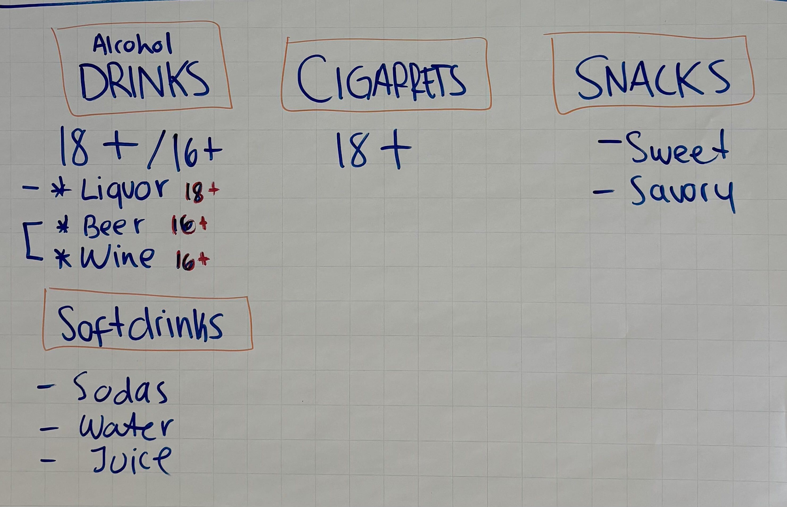

# Spaeti SnackEnd

## Product Categories

## User Flow

## Feature List

Roughly in descending order of importance:
- Email sending – user receives product pictures via email (check AWS SES API and/or Spring)
- Gift sending – allow sending orders directly to someone else 
- Age verification – verify user’s age before purchase 
- Ranking – e.g., most bought products in each category 
- Surprise Me – select random product(s) within user’s budget

Implement if there is enough time:
- Group buying – e.g., 6 beers for the price of 5, chips + soft drink combo discount
- Feedback – collect ratings or feedback for products/stores

## Kanban Board

The board for coordinating of working items can be found [here](https://github.com/users/deniz-oezdemir/projects/2/views/1).
