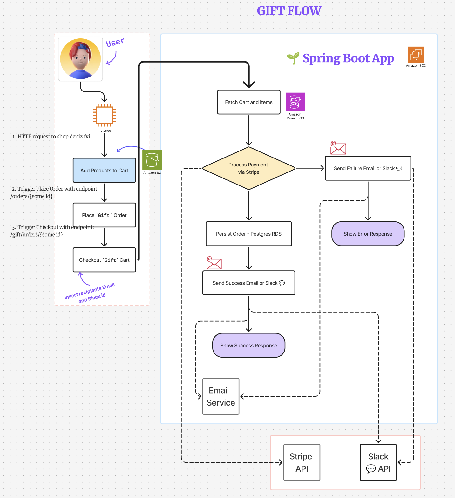

# Spaeti SnackEnd

This is the team project for the "Hero Tech Course 2025" by [Farhana](https://github.com/farhanaahmed), [Gabriela](https://github.com/knopgm), [Sara](https://github.com/saragrosser), and [Deniz](https://github.com/deniz-oezdemir).

## Table of Contents
- [Introduction](#introduction)
- [Project Implementation](#project-implementation)
  - [Sprint 1: Project Setup & Development Environment](#sprint-1-project-setup--development-environment)
  - [Sprint 2: Feature Development & Production Readiness](#sprint-2-feature-development--production-readiness)
  - [Sprint 3: Performance Optimization & Scalability Planning](#sprint-3-performance-optimization--scalability-planning)
- [Documentation Index](#documentation-index)
- [How to Run Locally](#how-to-run-locally)
- [User Flows](#user-flows)
- [Kanban Board](#kanban-board)

## Introduction

We implemented an online Späti Shop where users can buy and gift snacks and soft drinks.

Instead of the physical delivery of said products we will send the details and images of the products to the user via a chosen channel.

## Project Implementation
Our development followed a structured three-sprint agile methodology, each focusing on a key phase of the project lifecycle.

### Sprint 1: Project Setup & Development Environment
Goal: Establish a robust foundation for collaboration and deployment.

| Requirement                           | Implementation Status & Details                                                                                                          |
|:--------------------------------------|:-----------------------------------------------------------------------------------------------------------------------------------------|
| **Team & Project Name**               | ✅ [Spaeti SnackEnd](https://github.com/deniz-oezdemir/Spaeti-SnackEnd) established as the official name.                                 |
| **Development Documentation**         | ✅ [Comprehensive guidelines](README-Development-Documentation.md) defined.                                                               |
| **Code Review Process & PR Template** | ✅ Established a mandatory review process and implemented a [PR template](.github/pull_request_template.md) for all merges.               |
| **CI Pipeline (GitHub Actions)**      | ✅ Set up [automated build](https://github.com/deniz-oezdemir/Spaeti-SnackEnd/actions) and test workflows on every push and pull request. |

### Sprint 2: Feature Development & Production Readiness
Goal: Develop core functionality and ensure the service is production-ready.

| Requirement                             | Implementation Status & Details                                                                                                                                                 |
|:----------------------------------------|:--------------------------------------------------------------------------------------------------------------------------------------------------------------------------------|
| **Technical Features**                  | ✅ Implemented [Email](README-Email-Service.md) and [Slack](https://github.com/deniz-oezdemir/Spaeti-SnackEnd/pull/62) notifications for purchased Products.                     |
| **Core User Feature**                   | ✅ Implemented a [Gift flow Feature](https://github.com/deniz-oezdemir/Spaeti-SnackEnd/tree/docs/readme-gift-feature-email) that allows users to buy products and send a Gift notification for another user. |
| **API Documentation (Swagger)**         | ✅ Automated API documentation integrated and available. See our [API Documentation](README-APIs.md).                                                                            |
| **Logging Strategy**                    | ✅ [Structured logging](README-Logging-Strategy.md) implemented across services with INFO, WARN, and ERROR levels.                                                               |
| **Production Deployment (HTTPS)**       | ✅ Service deployed to a production AWS EC2 instance, secured with [HTTPS and a custom domain](README-HTTPS-Domain.md).                                                          |
| **Production Database & Safety Policy** | ✅ [PostgresSQL RDS instance](README-Database-Setup.md) provisioned. Policies implemented to prevent accidental data loss.                                                                               |
| **Monitoring & Observability**          | 🔄 Integrated CloudWatch for logging and basic monitoring alerts.                                                                                                               |

### Sprint 3: Performance Optimization & Scalability Planning
Goal: Enhance system resilience and performance under load.

| Requirement                           | Implementation Status & Details                                                                                                                                                 |
|:----------------------------------------|:--------------------------------------------------------------------------------------------------------------------------------------------------------------------------------|
| **Concurrency Handling** | ✅ Implemented [pessimistic and optimistic locking](README-Concurrency-Handling.md) to prevent overselling and data conflicts during checkout.                     |
| **Event-Driven Architecture** | ✅ [Refactored the gift feature](README-Event-Driven-Gift-Flow.md) into a fully asynchronous, event-driven flow to improve API response time and system resilience. |

## Documentation Index

Below you can find organized links to all our key documents, explaining everything from our coding standards to our production deployment strategy.

| Topic                    | Document Link | Description |
|:-------------------------| :--- | :--- |
| **Planning & Design** | | |
| Service Planning         | [README-Service-Planning.md](README-Service-Planning.md) | High-level overview of the product, user personas, and goals. |
| Tech Stack & Architecture | [README-Tech-Stack.md](README-Tech-Stack.md) | Detailed breakdown of technologies, architecture patterns, and sequence diagrams. |
| System Architecture      | [README-Architecture.md](README-Architecture.md) | High-level diagram of our AWS infrastructure and request flow. |
| Feature Specifications   | [README-Feature-Specifications.md](README-Feature-Specifications.md) | Detailed specs and test scenarios for all core features. |
| **Features & Services** | | |
| Gifting Flow             | [README-Gift-Flow-Email.md](README-Gift-Flow-Email.md) | Deep dive into the gift purchase feature and dual-notification logic. |
| Email Service            | [README-Email-Service.md](README-Email-Service.md) | Deep dive into the HTML email notification system and how to test it. |
| Slack Service            | [README-Slack.md](README-Slack.md) | Deep dive into the Slack notification system using Block Kit. |
| Order Service Features   | [README-Order.md](README-Order.md) | A log of features and implementation steps from the project's initial phases. |
| **Technical Implementation** | | |
| Concurrency Handling     | [README-Concurrency-Handling.md](README-Concurrency-Handling.md) | How we prevent data conflicts using pessimistic and optimistic locking. |
| Event-Driven Architecture | [README-Event-Driven-Gift-Flow.md](README-Event-Driven-Gift-Flow.md) | Details on the asynchronous, event-driven refactoring of the gift flow. |
| Logging Strategy         | [README-Logging-Strategy.md](README-Logging-Strategy.md) | Our approach to structured logging, request tracing, and error handling. |
| Performance Research     | [README-Research-Performance-Optimization-&-Scalability-Planning.md](README-Research-Performance-Optimization-&-Scalability-Planning.md) | Research document on scalability and performance topics. |
| **Operations & Guides** | | |
| Coding Conventions       | [README-Development-Documentation.md](README-Development-Documentation.md) | Our team's code conventions, branching strategy, and commit message format. |
| API Reference (Swagger)  | [README-APIs.md](README-APIs.md) | How our automated API documentation works and where to access it. |
| Testing Guide            | [README-Tests-Gifting-Flow.md](README-Tests-Gifting-Flow.md) | How to read and understand the API tests for the gifting feature. |
| Database Setup           | [README-Database-Setup.md](README-Database-Setup.md) | Guide to our production PostgreSQL database on AWS RDS and safety policies. |
| Production Deployment    | [README-HTTPS-Domain.md](README-HTTPS-Domain.md) | Step-by-step guide for deploying to AWS with a custom domain and HTTPS. |

## User Flows

The following diagrams illustrate the primary user journeys for purchasing items for oneself and sending them as a gift to someone else.

## Kanban Board

The board for coordination of working items can be found [here](https://github.com/users/deniz-oezdemir/projects/2/views/1).
